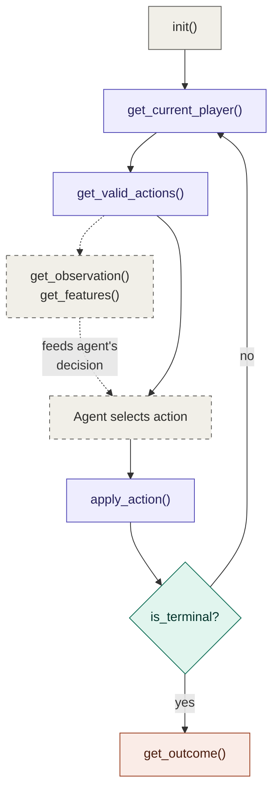
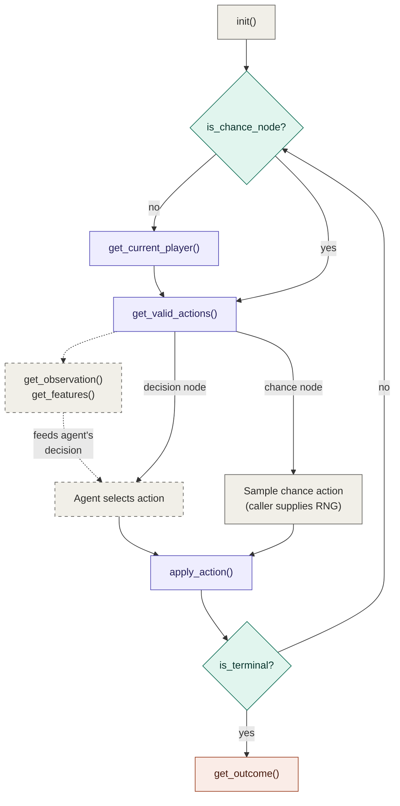

This repo contains a collection of board games, written in C (C99 and built using GNU Make), for the purpose of exploring/experimenting with reinforcement learning agents.

Available Games
===============

| Game                              | Tic-Tac-Toe | Pig |
|-----------------------------------|:-----------:|:---:|
| Num Players                       |      2      |  2  |
| State Size                        |      3      |  5  |
| Max Actions                       |      9      |  6  |
| Observation: Number of Dimensions |      3      |  1  |
| Observation: Dimensions           |  [2, 3, 3]  | [3] |
| Observation: Size                 |      18     |  3  |
| Features: Number of Dimensions    |      3      |  1  |
| Features: Dimensions              |  [2, 3, 3]  | [3] |
| Features: Size                    |      18     |  3  |

**Note:** Each game also defines a `STRING_BUF_SIZE` macro.

This is not shown in the table above as it is a derived constant for internal formatting and is not relevant to agent integration.

Building
========

The main build you will want to do is to build the static library, which will be output to `bin/board_games_lib.a`:

```shell
make lib
```

From there, you would include the headers in `include/*` and `bin/board_games_lib.a` in your project.

I've also included the ability to compile a "demo" executable, this is compiled by the `demo` target:

```shell
make demo
```

This is intended as a way to demo or smoke-test the game engine you are implementing.

Engine Structure
================

Each game must completely fulfil the `Game` interface located at [include/board_game.h](include/board_game.h). This allows for the following generic game loop:

Deterministic Games
-------------------



Note that the game loop differs slightly for games that feature an element of stochasticity, see [Modelling Stochasticity](#modelling-stochasticity) for more details.

See also [src/main.c](src/main.c) for a working example.

The `Game` Interface
====================

The `Game` struct (defined in [include/board_game.h](include/board_game.h)) is a vtable of function pointers and metadata that every game implementation must provide. All state is stored externally in a caller-allocated `uint64_t` array - the `Game` itself holds no mutable state.

**Note** that state is intended as a semi-opaque container for the game state. Agents are expected to observe the state of the game via the `get_observation()` or `get_features()` functions - not by inspecting the state directly! This is because some board games such as Liar's Dice or Poker are incomplete/hidden information games, so their state arrays will contain the **entire** information of the game state, which is not available to each player. `get_observation()` and `get_features()` expose only the information that a specific player should see.

Required Macros
---------------

Every game must define the following compile-time macros, each prefixed with a namespace (e.g. `TTT_` for Tic-Tac-Toe). These are used by callers to allocate correctly-sized buffers before calling into any `Game` function.

|             Macro             |                                                     Description                                                     |
|-------------------------------|---------------------------------------------------------------------------------------------------------------------|
| `<NAMESPACE>_NUM_PLAYERS`     | Number of players in the game.                                                                                      |
| `<NAMESPACE>_STATE_SIZE`      | Number of `uint64_t` elements required to represent the full game state.                                            |
| `<NAMESPACE>_MAX_NUM_ACTIONS` | Maximum number of actions that `get_valid_actions()` can return in any state.                                       |
| `<NAMESPACE>_STRING_BUF_SIZE` | Minimum `char` buffer size (including null terminator) that `to_string()` requires.                                 |
| `<NAMESPACE>_OBS_NDIMS`       | Number of dimensions in the observation tensor (e.g. `1` for a flat vector, `3` for channels × rows × cols).        |
| `<NAMESPACE>_OBS_SIZE`        | Total number of elements in the observation. Must equal the product of the first `OBS_NDIMS` entries in `obs_dims`. |
| `<NAMESPACE>_FEATURES_NDIMS`  | Number of dimensions in the features tensor.                                                                        |
| `<NAMESPACE>_FEATURES_SIZE`   | Total number of elements in the features tensor.                                                                    |

Function Pointers
-----------------

|       Function       |                               Signature                               |                                                                                                 Description                                                                                                |
|:--------------------:|:---------------------------------------------------------------------:|:----------------------------------------------------------------------------------------------------------------------------------------------------------------------------------------------------------:|
| `init`               | `void (const void* config, uint64_t state[])`                         | Initialise `state` to the start of the game. `config` is game-specific (may be `NULL`).                                                                                                                    |
| `get_current_player` | `uint64_t (const uint64_t state[])`                                   | Return the zero-based index of the player whose turn it is.                                                                                                                                                |
| `is_chance_node`     | `bool (const uint64_t state[])`                                       | Return `true` if the next action is a random outcome (die roll, card draw, etc.) rather than a player decision. Deterministic games always return `false`. See the "[Modelling Stochasticity](#modelling-stochasticity)" section for details. |
| `get_valid_actions`  | `uint64_t (const uint64_t state[], uint64_t actions_out[])`           | Write valid action IDs into `actions_out` and return the count.                                                                                                                                            |
| `apply_action`       | `void (uint64_t state[], uint64_t action)`                            | Mutate `state` in-place by applying `action`.                                                                                                                                                              |
| `is_terminal`        | `bool (const uint64_t state[])`                                       | Return `true` if the game is over (win, loss, or draw).                                                                                                                                                    |
| `get_outcome`        | `void (const uint64_t state[], int64_t scores_out[])`                 | Write per-player scores into `scores_out` (e.g. +1 win, -1 loss, 0 draw). Only meaningful when terminal.                                                                                                   |
| `get_observation`    | `void (const uint64_t state[], uint64_t player, uint8_t* obs_out)`    | Encode the `state` as a discrete observation tensor from player's perspective.                                                                                                                             |
| `get_features`       | `void (const uint64_t state[], uint64_t player, float* features_out)` | Encode the `state` as a floating-point feature tensor from `player`'s perspective, suitable for neural network input.                                                                                      |
| `to_string`          | `uint64_t (const uint64_t state[], uint64_t buf_size, char* buf)`     | Write a human-readable representation of the state into `buf`. Returns the number of bytes written.                                                                                                        |
| `help_prompt`        | `const char* (void)`                                                  | Return a static string describing the game's rules and move format.                                                                                                                                        |

Static Fields
-------------

|        Field       |      Type     |                                                   Description                                                  |
|:------------------:|:-------------:|:--------------------------------------------------------------------------------------------------------------:|
| `obs_dims[4]`      | `uint64_t[4]` | Shape of the observation tensor. Only the first `OBS_NDIMS` entries are meaningful (e.g. `{2, 3, 3}` for TTT). |
| `features_dims[4]` | `uint64_t[4]` | Shape of the features tensor. Only the first `FEATURES_NDIMS` entries are meaningful.                          |

Observation vs Features
-----------------------

Both `get_observation()` and `get_features()` encode the game state from a given player's perspective, but they serve different purposes:

- **Observation** (`uint8_t*`) - A semantically faithful, discrete/integer encoding of the game state. This is the "ground truth" representation i.e. each element maps precisely to a meaningful game concept. Useful for rule-based agents, debugging, and inspection.

- **Features** (`float*`) - A float encoding optimised for neural network consumption. This may normalise values, broadcast scalars across spatial dimensions, or apply other transformations beyond a simple cast of the observation. Note: A simple game (like Tic-Tac-Toe) may produce identical representation, but more complex games will diverge.

Memory Conventions
------------------

All memory is **caller-allocated**. The `Game` functions never allocate or free memory themselves. Before calling any function, the caller must allocate buffers according to the macros listed above. For example:

```c
uint64_t state[STATE_SIZE];
uint64_t actions[MAX_NUM_ACTIONS];
int64_t  scores[NUM_PLAYERS];
uint8_t  observation[OBS_SIZE];
float    features[FEATURES_SIZE];
char     string_buffer[STRING_BUF_SIZE];
```

Players are zero-indexed throughout (player 0 moves first).

Modelling Stochasticity
=======================

Some games contain randomness that is not directly controlled by any of the players e.g. dice rolls, card draws, shuffles, or any other outcome determined "by the game itself". The `Game` interface assumes that `apply_action(state, action)` is deterministic: given the same state and the same action, the resulting state should always be identical. This is a hard requirement for techniques like Monte Carlo Tree Search, which rely on being able to copy a state and replay actions to explore hypothetical futures.

To reconcile these two tensions, randomness is modelled as a dedicated _chance_ "player". Rather than baking a PRNG into `state` and having `apply_action()` draw from it, the engine exposes random outcomes as actions to be resolved at "chance nodes" (in the context of a game tree). Whether the current state is a chance node is reported by the `is_chance_node()` function on the `Game` interface - deterministic games always return `false` - as there is no random event to sample, stochastic games return `true` when awaiting a random outcome.

When `is_chance_node()` returns `true`:

- `get_valid_actions()` returns every possible random outcome as a list of action IDs (e.g. `{0, 1, 2, 3, 4, 5}` for a six-sided die, `{0, 1}` for a coin flip).
- The _caller_ - not the engine - samples one of those actions according to the game's chance distribution and passes it to `apply_action()`.
- `apply_action()` resolves the sampled outcome deterministically, then hands control back to whichever _real_ player should act next.

Agents never control the chance player directly. In a standard game loop, chance nodes are handled by a small branch that samples a random action and applies it _without consulting the agent_. See [src/main.c](src/main.c) for a reference implementation of this pattern.

A game has at most one chance player, visited possibly many times at different nodes. Multiple random events in a game are sequenced (or combined into a single joint action), not parallelised - the interface has exactly one `get_current_player()` and one `get_valid_actions()` per state, and this reflects a deeper assumption that at any given state, exactly one actor is about to act.

Decomposing Chance Events
-------------------------

How a game author breaks a random event into chance nodes is a modelling decision that affects whether a caller can sample correctly with a uniform RNG.

If a random event decomposes into independent uniform sub-events, it is more ergonomic to model it as _sequential_ chance nodes rather than a single "fat" chance node. For the scenario of rolling 2×d6 dice, for example, would naïvely be represented as one chance node with 21 or 36 actions - but then the correct distribution over those actions is non-uniform (e.g. (3,4) is twice as likely as (1,1)), and a caller sampling uniformly would silently compute wrong expected values. To fix this, the caller would have to carefully model the correct probability distribution to sample from! The more ergonomic modelling choice is two sequential chance nodes of six actions each, with `apply_action()` transitioning from "awaiting die 1" to "awaiting die 2" to the next player's turn. This way, each sub-event is now uniform, therefore using uniform sampling now _is_ correct, and the joint distribution falls out for free because probability composes multiplicatively down the game tree.

The same principle/strategy applies to revealing multiple cards, rolling multiple dice, or any compound random event whose components are independent and uniform.

At this point in time, I cannot envision a source of randomness in a board game that is _genuinely_ non-uniform and **cannot** be decomposed, so this is the main strategy used to model randomness. The few cases this principle does not handle are rare: inherently weighted physical randomisers (e.g. a loaded die), continuous distributions (which cannot be enumerated at all.

Summary: Why This Design
------------------------

Modelling chance as a dedicated player (rather than embedding a PRNG in state) has several benefits:

- _`state` remains a pure snapshot._ Copying a state and replaying actions produces an identical trajectory only if the same chance actions are replayed; different samples give different trajectories, exactly as a real random process would. This is essential for MCTS and any algorithm that explores hypothetical futures from a saved state.
- _No hidden RNG plumbing inside the engine._ The engine contains no global RNG, no per-state seed, and no hidden mutation across calls that misleadingly _appear_ pure. Callers bring their own PRNG, with whatever seeding and parallelism strategy suits their use case.
- _Chance nodes are first-class citizens of the game tree._ MCTS can expand them by enumerating every possible outcome and weighting each child by its probability. Expectimax search works without special-casing. Any tree-based search algorithm handles chance naturally rather than working around it.
- _Generalises cleanly._ The same mechanism handles dice, cards, tile draws, and any other stochastic event a future game might introduce — each game decides internally what "chance node" means via its is_chance_node() implementation.

The game loop differs slightly to the [deterministic game loop](#deterministic-games) in order to incorporate the chance player:


